# Microsoft 365 E5 Renew 帮助文档

###### 以下所有问题都以Plus为例子，Web不支持登录调用自动授权！！！！！！！！！！

###### 以下所有问题都以Plus为例子，Web不支持登录调用自动授权！！！！！！！！！！

###### 以下所有问题都以Plus为例子，Web不支持登录调用自动授权！！！！！！！！！！

###### 以下所有问题都以Plus为例子，Web不支持登录调用自动授权！！！！！！！！！！

###### 以下所有问题都以Plus为例子，Web不支持登录调用自动授权！！！！！！！！！！

## 前言(必读)

这是软件的帮助文档，一些常见的问题基本都能在这里找到答案，希望各位大佬能认真观看

建议使用Ctrl+F进行关键字搜索，快速定位自己想要查询的问题

如果有觉得自己没办法解决的问题，在群里提问的话，请参考一下

## 续订原理

### 设计思路

使用E5开发者账号注册应用，并通过注册的应用调用Microsoft Graph API（调用Microsoft Graph API是判定开发活动的一种）来伪装开发者活动（简单来说就是假装你是开发者，然后调用API进行E5续订）.

### 软件执行

Step1:获取应用程序访问令牌俗称MSAL-Token（非了解勿看系列）

Step2:通过HTTP请求使用获取到的访问令牌调用API（这个也一样）

## 常见问题

- Q:软件更新后需要重新配置吗

A:不需要重新配置

###### PS:在这里更新（有些时候可能会遇到更新失败的问题，等久一点就好了，好像是因为蓝奏云的原因）

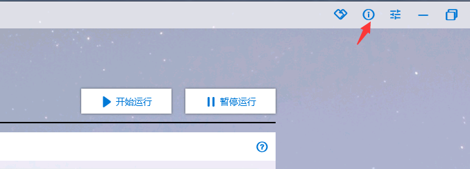

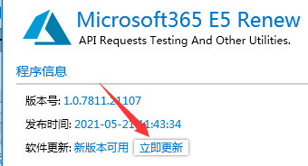

###### 如果软件更换电脑或目录后运行不需要重新配置，直接复制Config.cfg到新目录下就可以；但更换目录或者修改文件名会导致开机自启动失效，需要重新设定一次

-----

- Q:API调用失败信息中的 TOKEN-MSALER、TOKEN-HTTPER、TOKEN-EXCEPTION、REQUEST-HTTPER、REQUEST-EXCEPTION都是什么意思？

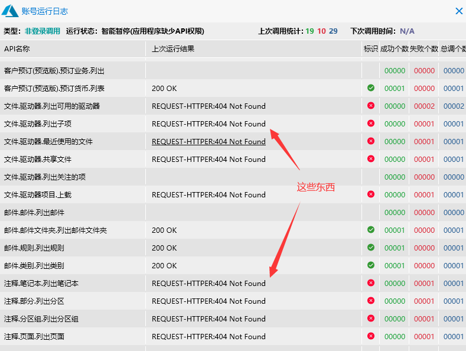

A:这些标头指代的是API调用过程中的错误发生步骤以及错误主要类型，API调用分为两个步骤上述QA已经讲到，步骤指示：TOKEN指代的是第一步令牌获取阶段发生错误、REQUEST指代第二步API调用时发生错误，错误主要类型：MSALER指示微软身份验证错误 这种一般都是用户关键信息填错误或者是在登陆调用下应用程序API缺少配置权限导致的、HTTPER指示该错误为HTTP请求过程中因网络原因或者目标服务器有意拒绝而导致的错误、EXCEPTION指示该错误为异常产生的错误无法定位错误原因

###### （同样是非了解勿看系列）

- Q:API调用出现了错误，但我无法分析错误原因

A:先查阅这个文档找一找有没有解决办法，如果自己无法定位原因请打开"运行日志"点击发生错误的API，鼠标悬浮能够出现下划线的日志都可以通过

###### 单击直接被复制，然后粘贴到群里询问

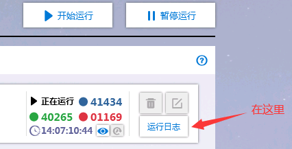

- Q:软件闪退崩溃怎么办（一般不会，我没崩溃过，一直都很稳）

A:软件偶尔闪退弹窗报错请复制程序同目录下的ErrorLog文档（自动生成的）发送给群主，无法运行启动等其他严重问题请直接联系群主或管理员。

### 应用注册&API配置

-Q:配置AP权限时没有 “代表XXX授予管理员同意”这个按钮 

A:说明当前登录的账号不是管理员账号 换用管理员账号登录重新创建应用

### 续订策略

-Q:软件需要后台一直运行吗

A:是的，建议这么做

我:一直挂着是最好的,但是一般来讲三天大概就能够续上，所以如果你时间观念够好的话，可以在过期前三天左右，或者在33天的时候一直运行这个软件，运行了三四天就能自动续上了（如果不行，请继续运行）

###### （如果不行，请继续运行）

- Q:软件选择哪个运行模式最好，API调用频率怎么设置

A:一般来说正常上班族选择默认设置+开机自启动就可以(即上班开始运行，下班停止运行)，如果你的设备是24小时的运行可适度降低调用频率选择实验性设置（实验性设置模拟865工作制）

我:个人认为随便就可以了，设置这个的目的，主要是想让你在微软面前装的更像开发者,不过还是建议设置的(装的更像，你就更稳)

- Q:API调用频率越高就越活跃，是不是可以尽可能提高API调用频率

A:不建议这么做，过多调用API可能会被微软判定为恶意请求进而导致封号（详见 Microsft Graph 限制指南），不随机的持续的不变的调用同一API有可能被判定为机器调用诈术导致封号 (太快可能会被认为有假，然后封号)

- Q:想自定义模式和运行策略，程序无法更改设置

A:选择自定义模式后可解锁修改功能（切记莫改的太离谱，否则后果自负）←←←←注意了啊

- Q:需要配置几个账户？子账户和管理员账户都要调用API嘛？ 

A:一般来说只使用一个账号（最好是管理员账户）调用API就可以了，多个账户调用的话看个人喜好

- Q:是否需要定期更换应用程序

A:建议定期更新，新的程序更加稳定或增加更多的新功能（其实不更新也没事，现在已经很稳了，又不是不能用.png）

### 续订时机

- Q:用了这个软件就能续订吗？调用API伪装开发者活跃，最低标准是什么

A:续订属于玄学问题，一句话说:调用API续订几率大，不调用API大概率不给续订

PS:按照我个人的使用来说，一般是都是会续的，但为了严谨来说，确实像上面说的那样（事实上我没见过用了这个软件续不上的）

- Q:什么时候能续订，为什么我用了软件天数还在减少

A:正常情况下在剩余最后30天的那一天会续订，但有少数情况少于30天还不给续订的（建议提高API调用量 在账号急救模式运行，注意别太高了），还有少数欧洲人大于30天就给续订的，大家要正视这个现象不要太慌张。

- Q:没有给续订过期了怎么办

A:可以通过软件上的快速链接前往申诉页填写申诉表单进行过期申诉   （请翻到最后查看补充）

- Q:E5账号过期申诉内容小作文写什么

A:暂无

### 调用失败

- Q:总有一两个API调用失败怎么办

A:可以忽视，皆属正常现象

- Q:登录调用 应用程序缺少API权限

A:分为两类,如下：

- ● 非登录调用:

请自行前往Microsoft Azure控制台 App Registrations API权限 查看相应权限是否放行。

注意选择权限时 选择的是 应用程序权限 不要选错了。

- ●  登录调用：

请您在Renew Plus 界面 用子号所意一个全局管理员账户进行授权。

同样，您也可在Microsoft Azure 控制台 App Registeration中 进行手动添加。注意选择权限时应选择 委托的权限

PS:推荐使用登录调用，因为更简单更方便，非登录调用要配置API，比较麻烦

以下附上 各模式下 所需API汇总图

非登录调用: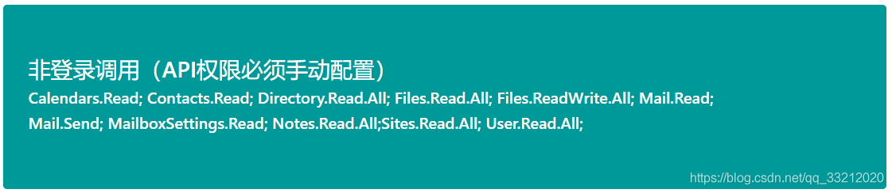

登录调用：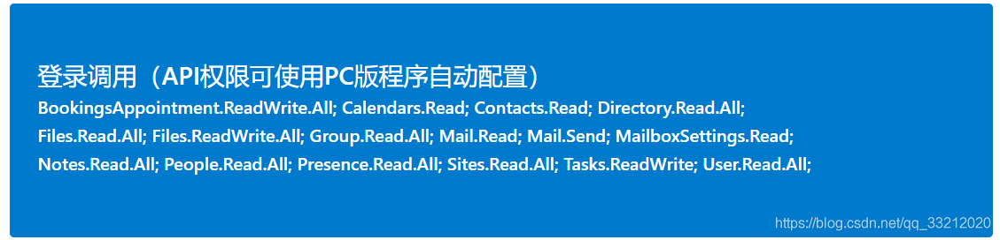

- Q:登录调用 账户登录被双重验证阻止

A:请登录多重身份验证设置然后按照下图配置进行操作

##### PS:双重验证有两种，另一个情况在下文←←←←注意

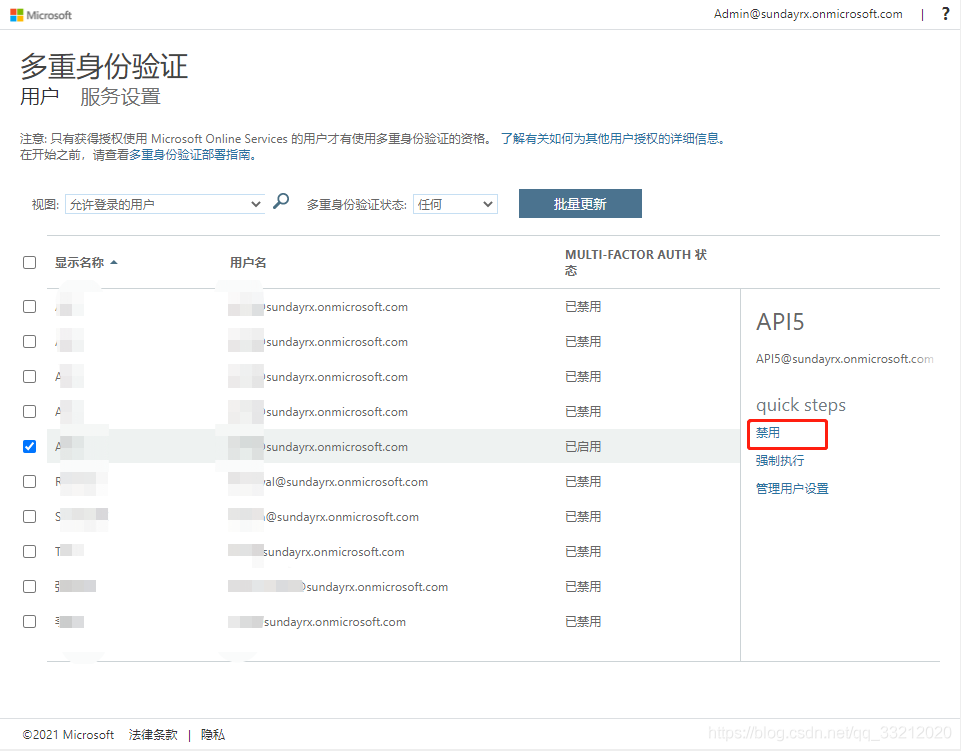

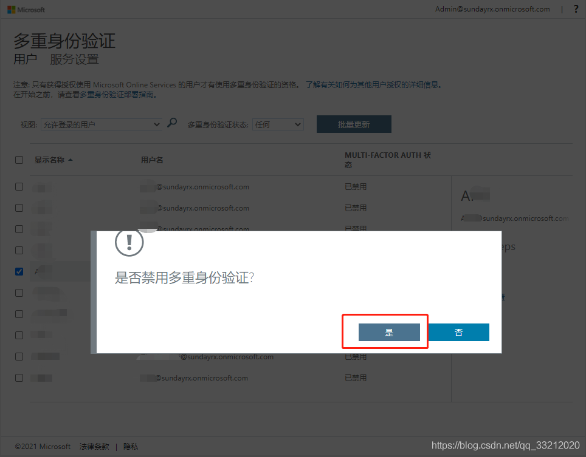

- Q:登录调用 未启用公共客户端-无键盘(设备代码流)

A:请前往Microsoft Azure控制台 App Registrations 验证 下拉到底部启用并点击左上角保存。

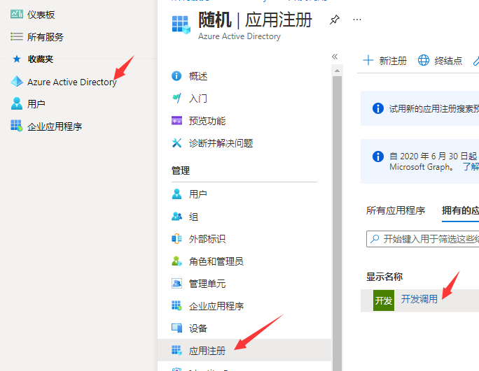

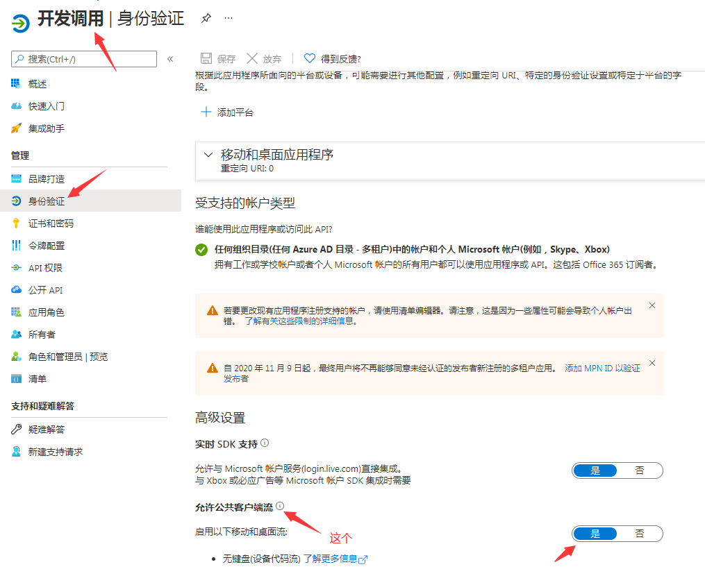

- Q:登录调用 账户密码已过期且需要更新，请更改账户密码

A:重新设定用户密码即可使用 ，可定期前往Azure AD 风险用户 选择有风险的用户 然后单击解除风控，也可设置密码永不过期请参照[永久密钥](help/permanent-sercet)进行修改

我:设置密码永不过期操作起来对小白不太友好，建议认真看(看不懂建议来群内提问，但希望先看一下文章开头提到的[提问的艺术](images/AskingArt.jpg)

- Q:应用程序处于禁用状态

A:该应用可能已经被删除进入应用回收站，进入Azure-应用注册-已删除的应用程序(预览)查看是否能够还原应用，若已经被彻底删除则重新注册一个应用使用就可以了

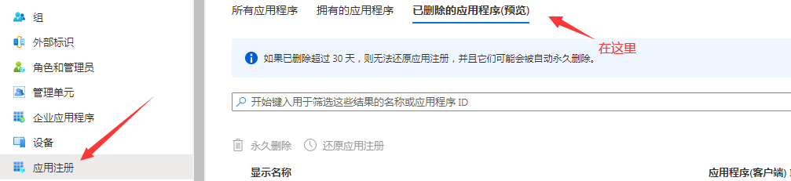

- Q:应用程序不存在此账户中

A:非登录调用请检查你的应用ID和密钥，登录调用请检查你的账户名和密码，并前往Microsoft Azure 控制台 App Registration → Owner 检查该名用户是否在程序Owner（拥有者）中,如果此用户未在此列表中，请予以手动添加。

- Q:若要登录到此应用程序，必须将账户添加到目录中

A:非登录调用请检查你的应用ID和密钥，登录调用请检查你的账户名和密码，并前往Microsoft Azure 控制台 App Registration → Owner 检查该名用户是否在程序Owner（拥有者）中,如果此用户未在此列表中，请予以手动添加。(没错，和上面的回答一模一样ㄟ( ▔, ▔ )ㄏ)

- Q:连续多次令牌请求失败，暂时被Azure风控阻止

A:短时间多次请求令牌，登录调用下短时间多次请求令牌失败都会触发Azure风控警告,该错误并不可怕，风控警告只持续15分钟并不是永久的，要找出真正引发风控的原因（好好翻阅运行日志），找出问题后尝试解决并等待15分后再次尝试，切勿继续运行（不等待15分钟）反复触发此错误

我:别太急，稳一点就行,慢一点就行了

- Q:文件、注释类API调用HTTPER 404 Not Found，其他API成功

A:进行API调用的账号太新了，新账号的许多服务还没初始化完成，等些日子就好了，可以选择“自定义模式”暂时取消勾选文件、注释类API

我：你号太新了，无法调用某些API,需要等久一点（几天就行了）基本就可以调用了

- Q:非登录调用  401 Unauthorized

A:该错误仅在非登录调用出现，意思非常明确是权限不足的意思，查看非登录调用的API权限是否配置正确齐全

- Q:403 Forbidden

A:非登录调用可能是API权限不足，登录调用属于正常现象

- Q:注释.分区组.列出分区组 403 Forbidden 一直失败 “注释”类其他API正常

A:这是由于Onedrive内文件过多导致的，超过5000个文件即报此错误，

- ●  解决方法：彻底删除调用账号Onedrive根目录下的“程序自动创建的文件夹”

- ● （使用“文件”类API程序会调用上传API上传文件到Onedrive）， 并清空二次回收站中的内容   
                                        
- ●  就是下图这个↓ （我也不知道里面的是什么东西，删掉就对了）

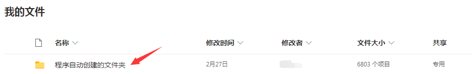

- Q:由于目标计算机积极拒绝，无法连接

A:这是代理软件导致的错误，在启动本软件时使用了代理软件（PAC或全局模式），但在使用本软件途中关闭了代理软件就会引发此错误；

解决方法:更新软件至1.0.7825.19662及以上版本，在设置-网络代理中选择“跟随系统（IE浏览器）代理”即可解决此问题

- Q:An error occurred while sending the request

A:这是代理软件导致的错误，使用了代理IP和端口但无法与目的地址建立链接；

解决方法:更新软件至1.0.7825.19662及以上版本，在设置-网络代理中选择“跟随系统（IE浏览器）代理”即可解决此问题(和上面的一样)

- Q:The SSL connection could not be established

A:这是代理软件导致的错误，使用了代理IP和端口但无法与目的地址建立SSL

解决方法:更新软件至1.0.7825.19662及以上版本，在设置-网络代理中选择“不使用代理服务器”或修复代理软件本身问题(和上面的不一样的)

### 账户登录

-Q:登录调用使用自动配置API权限，登录时报错AADSTSXXXXX，看不懂代码什么意思

A:详见[Azure AD 身份验证和授权错误代码](https://docs.microsoft.com/zh-cn/azure/active-directory/develop/reference-aadsts-error-codes)

我:对于一般小白而言基本是不用看的，这是名词解释，解释那些错误代码是什么意思的

-Q:E5开发者仪表盘：无法使用该账户登录，请改为你的Microsoft 365开发人员计划账户登录

PS:就是查看还有多少天过期，查看续订日期的地方

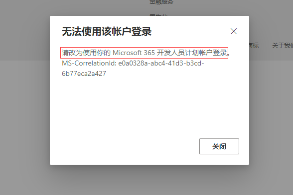

A:请按提示使用申请开发人员账户的个人账户登录，即后缀为qq.com；outlook.com；gmail.com等账户登录，而非使用后缀为onmicrosoft.com的账户等租户账户登录

##### 我:就是用你申请E5账号的那个账号登录，别问为什么还登录失效，肯定是你登录错了(这个问题太让人无语了，一脸那啥)

- Q:保护账户安全，组织要求你设置以下方法来证明你的身份

A:答案与下同

-Q:帮助我们保护你的账户，Microsoft已启用安全默认值来保护的你的账户安全，暂时跳过（14天后必须输入）

就是这个东西：

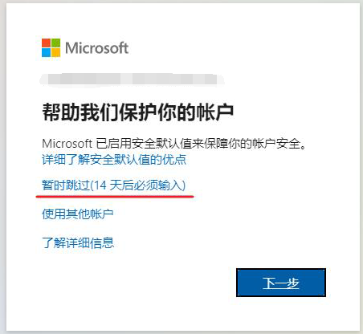

A:请登录[aad.portal.azure.com](https://aad.portal.azure.com)按照下图配置进行操作

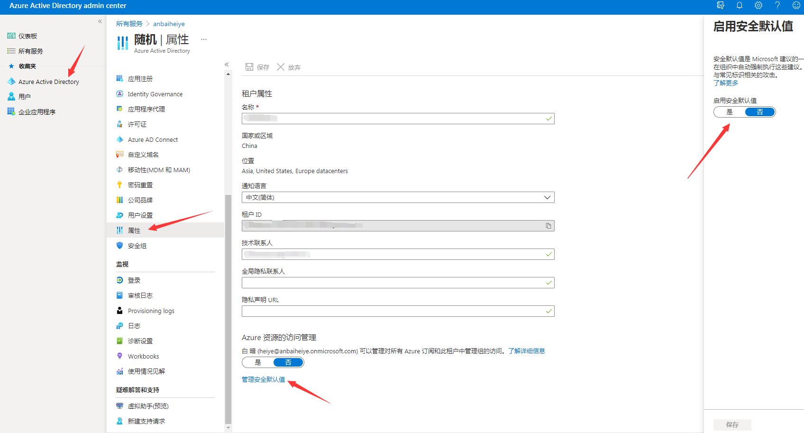

## 补充

一些经常使用的网址都在软件的开始页面有，并且具体的作用已经在下面标注了，请务必看一看，会提供相当大的便捷的

[返回首页](Home.md)

###### 本系列文档遵循CC-BY-NC-SA-4.0协议，如需转载请遵循此协议。

###### STAFF:SundayRX、黑夜(本文中的我)、Skyler、山抹微云/Gladtbam

###### [原文档](https://docs.qq.com/doc/DV1BibHVSSUhtUXdi)

###### Powered by [docsify](https://docsify.js.org/#/zh-cn/) | Based on GitHub-Page

